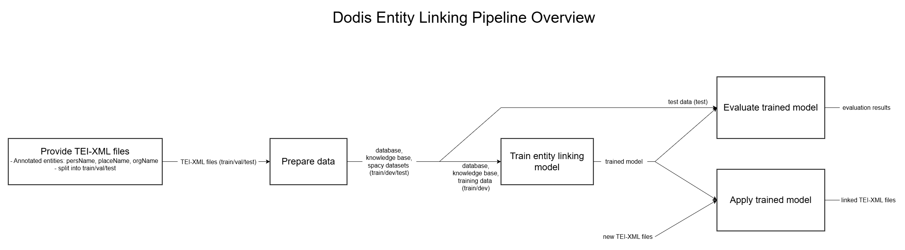

# Tutorial for Researchers: Using and training the Dodis Entity Linker 
This tutorial explains step by step how to install the project, prepare TEI-XML files, and train an entity-linking model.

You can use either the official Dodis TEI-XML files or your own compatible TEI-XML files. Compatible means that the files use the same structure as the Dodis TEI files, especially entity annotations such as `persName`, `placeName`, and `orgName` with suitable references.

This tutorial is intended for people who have experience using shell scripts.

## 1. What does this project do?
Many names are ambiguous. For example, when a text says "Müller", the system has to determine which Müller is meant. 

This project trains an entity linker. This linker is intended to connect recognized entities, meaning specific text passages such as names of people, places, or organizations, to unique entries in a knowledge base. 

In this project, that means: entities are linked to Dodis IDs.

The goal is a trainable model that can later be applied to new texts in order to automatically link entities.

### Pipeline overview


### Example of a linked TEI file
- [Open example output](Diagrams_documentation/example_linked_tei.html)
> Note: GitHub may display the HTML source code. You can still download the file or open it locally in a browser.

## 2. Key terms briefly explained
- **NER (Named Entity Recognition):** recognizes entities in text, for example people, places, and organizations. 
- **NEL (Named Entity Linking):** links these entities to unique IDs, in this project to Dodis IDs.
- **Span:** a marked text passage, for example "Bern" in a sentence. A span has a start and end position in the text.
- **Knowledge Base (KB):** a knowledge base containing entities. It includes IDs, labels/aliases, and additional information needed for linking. 
- **Config:** a configuration file. In spaCy, these files usually end in `.cfg`. They contain parameters such as paths, components, and training settings.
- **spaCy:** a Python library for natural language processing. In this project, spaCy is used to train the entity linker.
- **SLURM:** a system used to start jobs on a computing cluster. UBELIX uses SLURM.
- **UBELIX:** the high-performance computing cluster of the University of Bern.


## 3. Requirements
There are three ways to run this project. You need the following:

### A: Standard option (recommended): Shell scripts on UBELIX/SLURM
- Access to the UBELIX cluster or a comparable SLURM environment
- Access to a GPU partition or GPU nodes with NVIDIA/CUDA support
- A working cluster module environment
- Internet access for Python packages and, if needed, data download
- Git, or ZIP download as an alternative

> Note: The existing UBELIX script uses Python 3.12.3 and is prepared for a CUDA-capable GPU environment. 


### B: Shell scripts on a local computer with NVIDIA GPU
- A local shell environment
- Python 3.10 to 3.12 available locally 
- An NVIDIA GPU with an installed NVIDIA driver
- CUDA support
- Internet access for Python packages and, if needed, data download
- Git, or ZIP download as an alternative

### C: Alternative Option: Manual execution without shell scripts
The dependencies included in the project are designed for a CUDA-capable environment with an NVIDIA GPU. On systems without a suitable CUDA configuration or without an NVIDIA GPU, installation may fail or training may be very slow. In such cases, the PyTorch and CuPy dependencies in particular must be adjusted.

For preparation steps such as creating the database, a computer without a GPU may be sufficient. For the actual training, however, a GPU environment is required.

- Python 3.10 to 3.12 available locally 
- A virtual environment, for example `venv` or `conda`
- Internet access for Python packages and, if needed, data download
- Git, or ZIP download as an alternative

Additionally required for training:

- An NVIDIA GPU with an installed NVIDIA driver
- CUDA support

> Note: Local training without an NVIDIA GPU may be very slow or lead to memory problems. For initial tests, a small dataset can be used. The local option is intended for systems with an NVIDIA GPU/CUDA. On other systems, the PyTorch/CuPy dependencies must be adjusted.


## 4. Download the repository
With Git:
```bash
git clone https://github.com/afriendlyRaptor/Dodis_PSE.git 
cd Dodis_PSE
```

Without Git:
If you do not want to use Git, you can download the repository as a ZIP file, unzip it, and then open a terminal in the project folder.


## 5. Downloading the Dodis TEI-XML files or using your own files
TEI-XML files are required for training and for applying the model. You can use either the official Dodis TEI-XML files or your own compatible TEI-XML files. To create the training data, the project expects the XML files to be split into three datasets:

```text
data/dodis_transcription_xml/
  train/
  val/
  test/
``` 

- `train/` contains the files used to train the model
- `val/` contains the files used for development/validation during training
- `test/` contains the files used for evaluation


### Using Dodis TEI-XML files
To download and use the Dodis TEI-XML files from Hugging Face, run:
```bash
python src/helpers/download_dodis_xml.py
```

This requires the Python package `huggingface_hub` to be installed. If the command fails with `No module named huggingface_hub`, install the dependencies first as described in section 8.2, or run the setup part of the shell script for your chosen execution option.

> Note: Downloading data from Hugging Face may take some time the first time. After that, a local cache is used: `data/dodis_transcription_xml`.


### Using your own TEI-XML files
If you want to use your own TEI-XML files, you must split them into three folders `train`, `val`, and `test`. Create the required folder structure:


```bash
mkdir -p data/dodis_transcription_xml/train
mkdir -p data/dodis_transcription_xml/val 
mkdir -p data/dodis_transcription_xml/test
```

Then copy your TEI-XML files into the appropriate folders.

### Check the folders:

After downloading the files or saving your own files, make sure that the expected folders exist and contain TEI-XML files:

```bash
ls data/dodis_transcription_xml
ls data/dodis_transcription_xml/train
ls data/dodis_transcription_xml/val
ls data/dodis_transcription_xml/test
```

Expected result: The folders `train`, `val`, and `test` exist and contain TEI-XML files.


## 6. A: Standard Option (recommended): Shell Scripts on UBELIX/SLURM
Requirement: The folder `data/dodis_transcription_xml/` exists and contains three subfolders `train`, `val`, and `test`, each containing TEI-XML files. If this folder does not exist yet, first download the files (see Section 5 "Downloading the Dodis TEI-XML files or using your own files”).

The shell scripts are designed for use on a UBELIX cluster. If you are using another SLURM cluster, you must adjust the scripts accordingly. For local execution with shell scripts, see section 7. "B: Shell scripts on a local computer with NVIDIA GPU".

Possible adjustments to `src/dodis/run_dodis_training.sh` and `src/dodis/run_dodis_evaluation.sh`:

> Note: Some lines are commented out with #, so only one line is active at a time. You can add and/or modify additional commented-out lines, and you can change which lines are commented out and which are active. Make sure that only one option is active per setting.

- `mail-user`: Enter your own email address or omit this setting.
- `mail-type`: Specify when you want to receive email notifications, for example only when the job finishes (`end`) or also when it fails (`fail`).
- `account`: In our script, the job is assigned to the SLURM  account `gratis`. On your cluster, you may need to assign it to a different account/project.
- `partition`: This specifies that the job should run on the GPU partition.
- `qos`: Quality of Service names may be different on your system. 
- `gres`: This requests additional resources, in this case a GPU. Here you can adjust which GPU you want to use with `--gres=gpu:1`.
- `job-name`: Here you can adjust the job name.
- `ntasks`: Here you can specify how many tasks should be started, usually 1.
- `cpus-per-task`: Here you can specify how many CPU cores may be used per task.
- `mem-per-cpu`: Here you can specify how much RAM (memory) should be requested per CPU.
- `time`: Here you can specify the maximum runtime of the job. For example, `time=0-06:00:00` means that the job may run for a maximum of 0 days, 6 hours, 0 minutes, and 0 seconds. Your cluster may have time limits that you must follow.
- `output` and `error`: These specify where standard output and error output are written. We recommend not changing these.


> Note: If `sbatch` fails, for example with `Invalid account`, `Invalid partition`, or `Invalid qos`, the corresponding part must be adjusted for your environment.

- `module load`: This loads the specified module. Module names are cluster-specific, so you must adjust this part and insert the correct module name for your cluster.

Alternatively, you can run the individual Python scripts manually (see section 8 "C: Alternative Option: Manual execution without shell scripts").

> Note: Run all commands from the main folder of the repository. You can switch to the main folder with:

```bash
cd Dodis_PSE
```


### 6.1: Training the model
This script automatically runs several steps: preparing the Python environment, installing dependencies, creating the database, knowledge base, and training data, and training the entity-linking model. 

```bash
sbatch src/dodis/run_dodis_training.sh
```

After starting the job, you can use SLURM to check whether it is running:

```bash
squeue -u $USER
```

The script output is saved in the `job_logs/` folder.

After training has finished, you will find the best model at `output/dodis/model-best`. 


### 6.2: Evaluating the results

After training, the best model can be evaluated. The evaluation script checks how well the model links already known entities to the correct Dodis ID.

Requirement: The trained model must exist. You can check this with:
```bash
ls output/dodis/model-best
``` 

Start the evaluation with:
```bash
sbatch src/dodis/run_dodis_evaluation.sh
```

The evaluation script runs two evaluations.

1. Evaluation on the test set:
```bash
python src/dodis/evaluate_dodis.py --gpu 0
```
By default, the following files are used:
Model: `output/dodis/model-best`
Evaluation data: `data/dodis_test.spacy`

2. Evaluation on the dev set:
```bash
python src/dodis/evaluate_dodis.py --gpu 0 --test data/dodis_dev.spacy
```

The output is saved in the `job_logs/` folder.

The evaluation measures whether the model predicts the correct Dodis ID for already marked entity spans. For this, the known gold spans from the `.spacy` files are used, and the evaluation checks whether the correct Dodis ID is predicted. It primarily evaluates entity linking, not the detection of entity boundaries.


## 7. B: Shell scripts on a local computer with NVIDIA GPU

This option uses the same shell scripts but runs them locally with `bash` instead of `sbatch`. For local execution with shell scripts, some of the cluster-specific lines in the script must be disabled or removed.

> Note: This option still assumes GPU execution. The training script uses CUDA-related dependencies, checks GPU availability, and trains spaCy with a GPU. Therefore, this option is only suited for local computers with a working NVIDIA/CUDA setup.


### Removing the cluster-specific lines
#### SLURM lines for the cluster:
All lines starting with `#SBATCH` are SLURM directives. When the script is run locally with `bash`, these lines are treated as comments because they start with `#`. Therefore, they usually do not cause an error. For a clean local version of the script, removing them is recommended. 

```bash
#SBATCH --mail-user=
#SBATCH --mail-type=

#SBATCH --account=
#SBATCH --partition=
#SBATCH --qos=

#SBATCH --gres=
#SBATCH --job-name=

#SBATCH --ntasks=
#SBATCH --cpus-per-task=
#SBATCH --mem-per-cpu=
#SBATCH --time=

#SBATCH --output=
#SBATCH --error=
```

#### Module lines for UBELIX/cluster software modules:
All lines starting with `module` must be removed (or commented out using a `#`):

```bash
module purge
module load Workspace_Home
module load Python/...
module load CUDA/...
```

Instead of using these commands, rely on your own Python environment (venv/conda) and a working NVIDIA driver + CUDA-capable PyTorch installation.


### 7.1: Training the model
This script automatically runs several steps: preparing the Python environment, installing dependencies, creating the database, knowledge base, and training data, and training the entity-linking model. 

```bash
bash src/dodis/run_dodis_training.sh
```

The script output is shown in the terminal. If the script redirects output to files, these files are saved in the `job_logs/` folder.

After training has finished, you will find the best model at `output/dodis/model-best`. 


### 7.2: Evaluating the results

After training, the best model can be evaluated. The evaluation script checks how well the model links already known entities to the correct Dodis ID.

Requirement: The trained model must exist. You can check this with:
```bash
ls output/dodis/model-best
``` 

Start the evaluation with:
```bash
bash src/dodis/run_dodis_evaluation.sh
```

The evaluation script runs two evaluations.

1. Evaluation on the test set:
```bash
python src/dodis/evaluate_dodis.py --gpu 0
```
By default, the following files are used:
Model: `output/dodis/model-best`
Evaluation data: `data/dodis_test.spacy`

2. Evaluation on the dev set:
```bash
python src/dodis/evaluate_dodis.py --gpu 0 --test data/dodis_dev.spacy
```

The output is shown in the terminal. If the script redirects output to files, these files are saved in the `job_logs/` folder.

The evaluation measures whether the model predicts the correct Dodis ID for already marked entity spans. For this, the known gold spans from the `.spacy` files are used, and the evaluation checks whether the correct Dodis ID is predicted. It primarily evaluates entity linking, not the detection of entity boundaries.


## 8. C: Alternative Option: Manual execution without shell scripts
This option is mainly intended for people with a local CUDA-capable NVIDIA GPU. The file `src/dodis/requirements.txt` contains CUDA-specific packages, including packages for PyTorch and CuPy. For that reason, this installation option is not fully platform-neutral.

If you can work on UBELIX or a comparable SLURM cluster, we recommend using the standard option from section 6.

If you want to work locally, please note:

- macOS does not support NVIDIA CUDA. The requirements must be adjusted for macOS.
- On Windows, installation may work, but it depends on the Python version, NVIDIA driver, CUDA version, and matching PyTorch/CuPy packages.
- A GPU is required to use this project, especially for training. Individual preparation steps can also be run without a GPU.

Requirement: The folder `data/dodis_transcription_xml/` exists and contains three subfolders `train`, `val`, and `test`, each containing TEI-XML files. If this folder does not exist yet, first download the files (see Section 5 "Downloading the Dodis TEI-XML files or using your own files”).

> Note: Run all commands from the main folder of the repository. You can switch to the main folder with:
```bash
cd Dodis_PSE
```

### 8.1: Create, activate, and check the virtual environment

macOS/Linux:
```bash
python -m venv venv
source venv/bin/activate
```
Windows(PowerShell):
```bash
python -m venv venv
.\venv\Scripts\Activate.ps1
```

You can check whether the virtual environment is activated with:

macOS/Linux:
```bash
which python
```
Windows:
```bash
where python
```

Expected result: The path points to the project directory and contains `venv`, for example:

`.../Dodis_PSE/venv/bin/python` (macOS/Linux)

`...\Dodis_PSE\venv\Scripts\python.exe` (Windows)


### 8.2: Install and check dependencies, including spaCy
First install the Python packages:
```bash
pip install -r src/dodis/requirements.txt
```

Then install the required spaCy models:
```bash
python -m spacy download de_core_news_sm
python -m spacy download de_core_news_lg
python -m spacy download de_dep_news_trf
```

You can check whether spaCy was installed correctly with: 
```bash
python -m spacy info
```

You can check whether transformer support is available with:
```bash
python -c "import spacy_transformers; print('spacy_transformers OK')"
```

You can check the training configuration with:
```bash
python -m spacy debug config train_el_dodis.cfg
```

You can check whether your PyTorch installation can use the GPU (only if an NVIDIA GPU and driver are present) with:
```bash
python -c "import torch; print('cuda available:', torch.cuda.is_available()); print('torch cuda:', torch.version.cuda)"
```

Expected result: `cuda available: True`

If it says `False`, PyTorch cannot use the GPU.

### 8.3: Create the database and training data
First, the TEI-XML files must be converted so that spaCy can use them for training.

`build_dodis_db.py` creates a SQLite database from the TEI files with all entities and their alias frequencies.

`build_dodis_train_data.py` creates `.spacy` files for training, development, and testing.

```bash
python src/dodis/build_dodis_db.py
python src/dodis/build_dodis_train_data.py
```

Expected result: New files are created in the `data/` folder: a database file `dodis_entities.db` and training data files `dodis_train.spacy`, `dodis_dev.spacy`, and `dodis_test.spacy` in `.spacy` format. You can check this with:

```bash
ls data/dodis_entities.db
ls data/dodis_train.spacy
ls data/dodis_dev.spacy
ls data/dodis_test.spacy
```

Expected result: All four files should exist.

### 8.4: Create the knowledge base
Entity linking requires a knowledge base. The knowledge base is built from the SQLite database. The database should have the following schema:

```text
entities(id TEXT PRIMARY KEY, type TEXT)
aliases(alias TEXT, entity_id TEXT, freq INTEGER, PRIMARY KEY (alias, entity_id))
```

Alias probabilities are calculated proportionally to frequency:
`P(entity | alias) = freq(entity, alias) / Σ freq(*, alias)`

Entity frequency = sum of all alias frequencies of this entity in the corpus

```bash
python src/dodis/build_dodis_kb.py --model de_dep_news_trf
```

> Note: Use `--model de_dep_news_trf` here. This model matches the current training configuration. If the KB is created with a different model, training may fail or use incorrect vector dimensions.

Check afterward:
```bash
ls data/dodis_entities.kb
```

Expected result: The path `data/dodis_entities.kb` should exist.


### 8.5: Start training with spaCy
Start training with spaCy:

```bash
python -m spacy train train_el_dodis.cfg --output output/dodis --gpu-id 0
```

The parameter `--gpu-id 0` tells spaCy to use the first available GPU for training.

Expected result: A trained model is created in the `output/dodis/` folder, for example as `output/dodis/model-best` or `output/dodis/model-last`.


You can check this with:
```bash
ls output/dodis
ls output/dodis/model-last
ls output/dodis/model-best
```

> Note: If training takes a very long time or memory problems occur, start with a smaller dataset first (see Troubleshooting).


### 8.6: Where to find the result
After successful execution, you will find the most important files here:

- SQLite database: `data/dodis_entities.db`
- Training data: `data/dodis_train.spacy`
- Dev data: `data/dodis_dev.spacy`
- Test data: `data/dodis_test.spacy`
- Knowledge base: `data/dodis_entities.kb`
- Best trained model: `output/dodis/model-best`
- Last trained model: `output/dodis/model-last`


### 8.7: Evaluating the results

After training, the best model can be evaluated. The evaluation script checks how well the model links already known entities to the correct Dodis ID.

Requirement: The trained model must exist:
```bash
ls output/dodis/model-best
``` 

Start the evaluation with:
```bash
python src/dodis/evaluate_dodis.py --gpu 0
```

By default, the following files are used:
Model: `output/dodis/model-best`
Evaluation data: `data/dodis_test.spacy`

The evaluation measures whether the model predicts the correct Dodis ID for already marked entity spans. For this, the known gold spans from the `.spacy` files are used, and the evaluation checks whether the correct Dodis ID is predicted. It primarily evaluates entity linking, not the detection of entity boundaries.


## 9. Inference: Applying the model to new TEI-XML files
After training, you can use the trained model to automatically link entities in new TEI-XML files to Dodis IDs.


> Note: The current inference script does not detect new entity boundaries. It expects the entities in the TEI-XML file to already be marked with tags such as `persName`, `placeName`, or `orgName`. The script then predicts the appropriate Dodis ID for these existing annotations and writes it as a `ref` attribute in the output file. Existing `ref` attributes are overwritten.


Requirements:

- The trained model must exist:
```bash
ls output/dodis/model-best
```

If this folder does not exist, run the training first.

You need a TEI-XML file in which the entities to be linked are already annotated. The following are supported:
- `persName` for people
- `placeName` for places
- `orgName` for organizations


> Note: Run all commands from the main folder of the repository. You can switch to the main folder with:

```bash
cd Dodis_PSE
```

Use the trained model with:

```bash
python src/dodis/link_tei.py input.xml output.xml
```
- `input.xml` is the TEI-XML file to be linked.
- `output.xml` is the new file where the result will be written.


By default, the script uses the model at `output/dodis/model-best`. If you want to use a different model, you can specify the model path as follows:

```bash
python src/dodis/link_tei.py input.xml output.xml --model output/dodis/model-best
``` 

After successful execution, the script writes a new TEI-XML file. You can check it with:
```bash
ls output.xml
```

The script also reports how many entities were linked and how many could not be linked.


## Troubleshooting:

### "No module named spacy"
The virtual environment is not active. Activate the virtual environment and install the dependencies again.

### Can't find model...
The spaCy model is not installed, or the configuration file refers to a model that is not available. Check `train_el_dodis.cfg` and make sure the required spaCy models are installed.

### Loss/metrics stay at 0
Typical causes:
- No training examples are being loaded because of an incorrect path
- Labels/spans are missing or incorrectly formatted
- A component was accidentally frozen
- Candidate generation does not find any candidates because the KB does not match

Debugging steps:
- Test with a small dataset, such as 10-100 examples
- Print 5 training examples: text + span + ID
- Check the KB: does it contain the IDs that appear in the labels?

### "out of memory"/very slow
The dataset is too large for CPU. Start small or use a GPU.

### No module named `spacy_transformers` 
Install the requirements again.


### CUDA is not available
The NVIDIA driver/CUDA is not installed correctly, or there is no NVIDIA GPU. Run training on a GPU server/cluster.


### No log files or errors when starting the SLURM job
The SLURM scripts write their output to the `job_logs/` folder. This folder is usually already included in the repository. If the folder is missing, log files may not be written. Create the folder again:

```bash
mkdir -p job_logs
``` 

### New XML files are not being included:
If you changed or repartitioned the XML files, first delete the already generated files and create them again:

```bash
rm -f data/dodis_entities.db
rm -f data/dodis_train.spacy data/dodis_dev.spacy data/dodis_test.spacy
rm -rf data/dodis_entities.kb
```
Then rerun the steps for creating the database, training data, and knowledge base.


### Model not found: `output/dodis/model-best`
Check whether training completed successfully:

```bash
ls output/dodis/model-best
```

If `output/dodis/model-best` does not exist, you need to run the training again. 

### No module named `lxml`
The inference script requires the Python package `lxml`. If needed, install it again with:

```bash
pip install lxml
```
